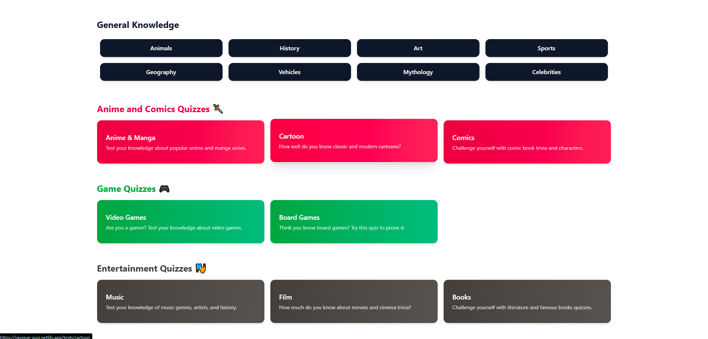
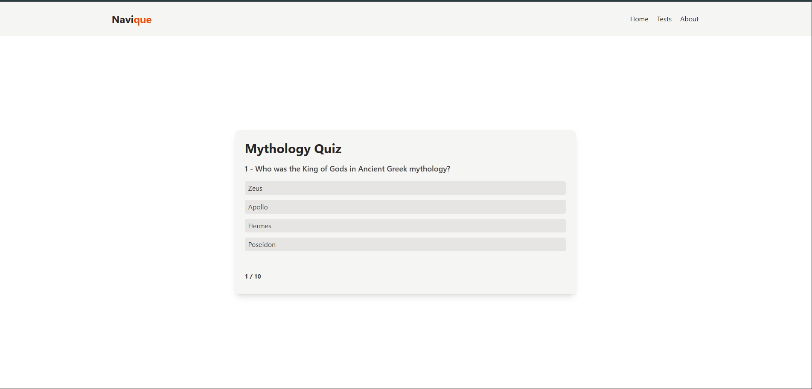
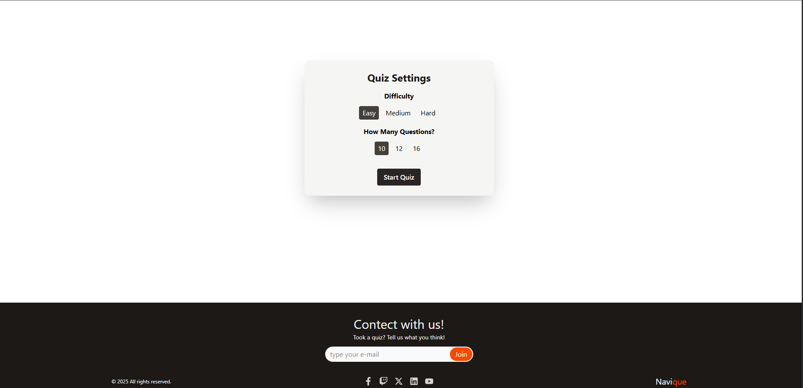

# 🧠 Navique Quiz App

**Navique** is a sleek and responsive quiz application where users can test their knowledge across various categories and difficulty levels.  
Powered by the Open Trivia API, it offers a fast and clean quiz experience.

**🌐 Live Demo:** [https://navique-quiz.netlify.app](https://navique-quiz.netlify.app)

---

## 🖼️ Screenshots

> *(Add screenshots in your public folder and update the paths below accordingly)*

  
  



---

## 🚀 Features

- 🎯 Choose quiz category and difficulty
- ❓ Dynamic question fetching using Open Trivia API
- ✅ Instant feedback with result screen
- 🌙 Light/Dark mode support
- 🧠 Track correct/incorrect answers
- 📱 Fully responsive layout
- ⚡ Fast, modern and clean UI

---

## 🛠️ Built With

- [Next.js (App Router)]
- [TypeScript]
- [Tailwind CSS]
- [Open Trivia API](https://opentdb.com/)
- [React Hooks] (`useState`, `useEffect`)

---

## 📦 Getting Started

To run this project locally:

```bash
# Clone the repository
git clone https://github.com/KKocbeler/Navique.git

# Go to the project directory
cd Navique

# Install dependencies
npm install

# Start the development server
npm run dev
```

---

## 📫 Contact

- 📧 Email: kkocbeler@gmail.com  
- 💼 LinkedIn: [Kemal Koçbeler](https://www.linkedin.com/in/kemalkocbeler/)

---

## 🙌 Would love to hear your thoughts and feedback!  
🧪 Try solving a few questions and see how many you can get right!
